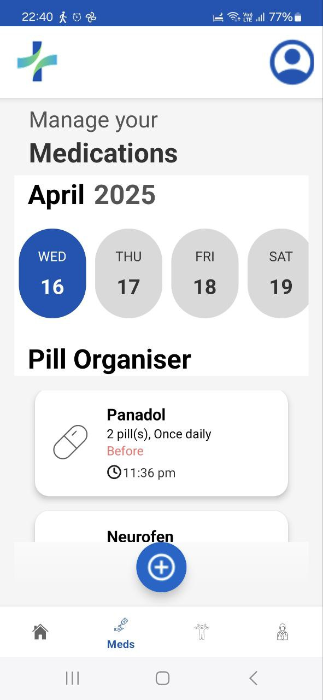

# Group 49


# MedAssist – Android App

- **MedAssist** is a comprehensive and intuitive Android application built to streamline the management of personal healthcare routines.  
- With MedAssist, users can easily log upcoming medical appointments, set medication reminders with timely alerts, and track daily exercise activities, all within a single platform.  
- The app features a clean, user-friendly interface and supports Firebase authentication, real-time notifications, and reliable scheduling to ensure a seamless user experience.


---

## Table of Contents
- [Video-Demo](#Video-Demo)
- [Features](#features)
- [Tech Stack](#tech-stack)
- [Installation](#installation)
- [Usage](#usage)
- [Screenshots](#screenshots)
- [Project Structure](#project-structure)
- [Developer Notes](#developer-notes)
- [Credits](#credits)

---

## Video-Demo

- **Click this link to view a video which goes through all the features of our app.** – ([Video Demo](https://drive.google.com/file/d/1z_FnjLKfWgcMWztDu_WebivK5sGcrhnq/view)) 

---

## Features

- **User Authentication** – Secure sign-in and sign-up using Firebase Authentication  
- **[P0] Medication Reminders** – Get notified to take medications on time  
- **[P1] Appointment Tracker** – Track and customise upcoming doctor visits 
- **[P2] Exercise Tracker** – Visualize and edit exercise logs and routines 
- **[P0/ 1]Notifications** – Receive timely alerts to keep track of reminders
- **[P0/ 1/ 2] Home Page** - Displays dynamically populated summary cards on user's medications for the day, upcoming appointments, and exercise tracker.

---

## Tech Stack

- **Language**: Java  
- **IDE**: Android Studio  
- **Authentication**: Firebase Auth
- **UI**: XML 
- **Database**: Firebase Realtime Database 

---

## Installation

1. Clone the repository:
   ```bash
   git clone https://github.com/yourusername/MedAssist.git

2. Open the project in **Android Studio**
3. Then, go to the [Firebase Console](https://console.firebase.google.com/)
4. Create a Firebase project (or use an existing one)
5. In the **Project Overview**, click **"Add app"** → choose **Android**
6. Register your app with the correct **package name** (e.g., `com.example.medassist`)
7. Download the generated `google-services.json` file
8. Place the file inside your project’s `/app` directory:
9. Run the app on an emulator or physical device


## Usage

- Tap **Register Account** page if you're a first-time user; otherwise, log in normally.
- Enter your details and verify your account.
- Once you click the verification link sent to your email, your account will be successfully verified.
- After verification, log in normally.
- Users can reset their passwords by clicking **Forgot Password**. You’ll be prompted to enter your email address and will receive a link to reset your password.
- Users would then be brought to the home page, where they would be able to navigate to other pages either through clicking on the respective cards in **Homepage** or by clicking on the bottom navigation bar.
- Tap the **Medications** tab to create medication reminders.
- Tap the **"Add Medication"** button for a medication form to pop up. Upon submitting the form, the newly added medication would then be shown under the user's daily list of medications to take. Reminders would be sent at the time users need to consume the medication.
- Use the **Appointments** tab to set and edit doctor visits. Similar to the **Add Medication** button, the **Add Appointments** button would also allow users to add their appointments for that selected date. Reminders would be sent one hour before the user's appointmnet timings, this is to give allowance for travel and preperation.
- Tap the **Exercise** tab to create and monitor the progress of exercise routines.
- You can delete appointments and medications by **pressing and holding** the said item in the **Appointments** or **Medications** tab.
- Tap the Profile icon to view all previously saved medications and appointments.
- You can view a summary of medications to be taken today, upcoming appointments within the week, and today's exercise progress on the **Home Page**.

---


## Screenshots

### Login & Registration


*Login screen with Firebase email/password authentication*


*User registration form with email verification prompt*

---

### Medications 



*View and manage all added medications*

---

### Appointments & Exercises


*List of upcoming doctor appointments*


*Track and schedule exercise routines*

---

### Homepage


*Homepage showing upcoming health tasks*


---

## Project Structure

com.example.medassist  
├── ui  
│   ├── allmedications  
│   │   ├── AllMedicationsFragment  
│   │   ├── AllMedicationsViewModel  
│   │   └── AllMedicationsViewModelFactory  
│   ├── appointment  
│   │   ├── Appointment  
│   │   ├── AppointmentFormDialog  
│   │   ├── AppointmentFragment  
│   │   ├── AppointmentRepository  
│   │   └── AppointmentViewModel  
│   ├── exercise  
│   │   ├── BarChartView  
│   │   ├── ExerciseFragment  
│   │   └── ExerciseViewModel  
│   ├── login  
│   │   ├── BaseAuthActivity  
│   │   ├── EmailAuth  
│   │   ├── LoginActivity  
│   │   ├── RegisterActivity  
│   │   └── VerifyActivity  
│   ├── medication  
│   │   ├── AlarmReceiver  
│   │   ├── DateItemAdapter  
│   │   ├── DatePickerFragment  
│   │   ├── DialogHelper  
│   │   ├── Medication  
│   │   ├── MedicationAdapter  
│   │   ├── MedicationFormDialog  
│   │   ├── MedicationFragment  
│   │   ├── MedicationRepository  
│   │   ├── MedicationViewModel  
│   │   └── NotificationHelper  
│   ├── reminders  
│   │   ├── ReminderFormDialog  
│   │   └── ReminderRepository  
│   ├── settings  
│   │   ├── SettingsFragment  
│   │   └── SettingsViewModel  
│   ├── transform  
│   │   ├── Appointment  
│   │   ├── AppointmentCard  
│   │   ├── BaseCard  
│   │   ├── CardActionHandler  
│   │   ├── Exercise  
│   │   ├── ExerciseCard  
│   │   ├── Medication  
│   │   ├── MedicationCard  
│   │   ├── TransformFragment  
│   │   └── TransformViewModel  
├── MainActivity


---

## Developer Notes

- Firebase dependencies must be configured properly  
- Ensure time zone settings are accurate for alarms
- Ensure that you are using the latest version of **Android Studio** and **Gradle plugin** versions should be at least **8.8** for compatibility

## Credits

- **Developed by Group 49**: Balraj Singh Dhaliwal, Gay Kai Feng Matthew, Tan Shi En Cion, Lee Jya Yin, Otso Tuomas Tuovinen, Kyaw Zin Htoo

